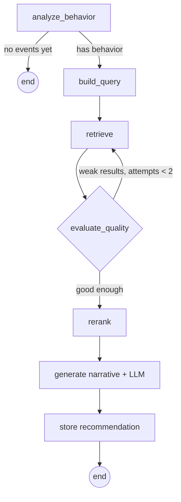

# SmartReco

**An AI agent that watches how you browse a course marketplace, figures out what you're actually
trying to learn, and tells you — in plain, specific language — exactly which course to take next
and why.**

Every page view, search, scroll, and click on SmartReco is silently tracked. A background agent
watches that behavior build up, reasons over it through an explicit multi-step workflow, retrieves
the most relevant courses from a vector database, and writes a short first-person narrative
explaining why those specific courses fit *this* learner *right now*. No generic "popular courses"
rail — every recommendation is grounded in real behavior and a real catalog.

## Why this stands out

| Bonus | Status |
|---|---|
| ⭐ Structured agent framework | **Built with LangGraph** — the pipeline is an explicit state graph (see below), not one opaque function |
| ⭐ Observability | **LangSmith tracing** on every node — flip one env var to see the full reasoning trace |
| ⭐ Retrieval polish | Real re-ranking: semantic score blended with category-match + recency, plus category diversification so results aren't 5 near-duplicates |
| ⭐ Scheduled proactive delivery | **Daily email digest** via APScheduler (`AsyncIOScheduler`) — not a manual button |
| Efficiency & production thinking | Agent only fires on meaningful triggers (never per-event), events are batched/throttled client-side, failed vector writes retry automatically |

## The agent, visually

The recommendation pipeline is a real [LangGraph](https://github.com/langchain-ai/langgraph) state
machine — it analyzes behavior, retrieves candidates, **judges its own retrieval quality**, and
loops back to broaden the search if the first pass came up thin, before ever calling the LLM:



Every node above is `@traceable` — with `LANGCHAIN_TRACING_V2=true` set, a full LangSmith trace of
that exact graph shows up for every recommendation generated.

## Architecture

- **FastAPI** (async) serves both a JSON API and server-rendered Jinja2 pages from one app.
- **SQLite** (SQLAlchemy async ORM + aiosqlite) is the system of record: users, products, events,
  recommendations, email delivery log.
- **ChromaDB** (in-process, persisted to disk) stores product embeddings for semantic search. Every
  product create/update/delete is **dual-written** to SQLite and ChromaDB, atomically, with a retry
  queue if the vector write fails.
- **Mesh API** (OpenAI-SDK compatible) is the only path to any LLM or embedding call — chat uses
  `openai/gpt-4o-mini`, embeddings use `openai/text-embedding-3-small`.
- **Vanilla JS tracker** (`static/js/tracker.js`) batches behavioral events in memory and flushes via
  `fetch(keepalive)` or `navigator.sendBeacon` on unload — tracking never blocks the page.
- **The agent** (`agent.py`) is a compiled LangGraph graph, triggered from a FastAPI `BackgroundTask`
  after each event batch — never awaited in the request path.
- **APScheduler** runs the daily digest job and a background retry job for failed vector writes.

```
routers/          auth, products, events, recommendations, pages, admin
templates/        Jinja2 HTML (base + auth/products/admin/partials)
static/           main.css, tracker.js, main.js
main.py           FastAPI app + lifespan startup
config.py         settings from .env
database.py       async engine/session
models.py         SQLAlchemy tables
schemas.py        Pydantic request/response models
auth.py           JWT + bcrypt
dependencies.py   FastAPI DI: get_current_user, get_current_user_optional, require_admin
vector_store.py   ChromaDB client + Mesh embeddings (traced)
agent.py          the LangGraph recommendation pipeline
observability.py  LangSmith traceable() wrapper (safe no-op if unset)
scheduler.py      APScheduler jobs
email_service.py  SMTP sending
seed.py           first-run product + admin seed data
```

## Prerequisites

- Python 3.11+
- A Mesh API key (`MESH_API_KEY`) — **every** LLM/embedding call in this app goes through Mesh

## Setup

```bash
# 1. Clone / open the project directory
cd HACKATHON

# 2. Create and activate a virtual environment
python -m venv .venv
.venv\Scripts\activate        # Windows
# source .venv/bin/activate   # macOS/Linux

# 3. Install dependencies
pip install -r requirements.txt

# 4. Configure environment
copy .env.example .env        # Windows
# cp .env.example .env        # macOS/Linux
# then edit .env and set at minimum: MESH_API_KEY, APP_SECRET_KEY, ADMIN_EMAIL, ADMIN_PASSWORD

# 5. Run the app
uvicorn main:app --reload
```

Visit `http://127.0.0.1:8000`. On first startup the app will:

1. Create all SQLite tables.
2. Seed 25 realistic courses across AI/ML, Web Development, Data Science, DevOps, and Mobile
   Development (only if the `products` table is empty), dual-writing each into ChromaDB.
3. Create the admin account from `ADMIN_EMAIL` / `ADMIN_PASSWORD` (only if no admin exists yet).
4. Initialize the ChromaDB collection at `CHROMA_PERSIST_PATH`.
5. Start the APScheduler jobs (daily digest + vector-write retry).

## First admin account / admin panel

The admin account is auto-created from `ADMIN_EMAIL` / `ADMIN_PASSWORD` in `.env` on first startup.
Log in at `/login`, then open "Admin" in the user menu (or go to `/admin`) to reach:

- `/admin` — dashboard stats (users, active products, events in last 24h, recommendations generated)
- `/admin/products` — full product CRUD with dual-write to SQLite + ChromaDB
- `/admin/events` — recent event explorer across all users
- `/admin/recommendations` — generated recommendation explorer

## Development mode

`uvicorn main:app --reload` runs with auto-reload enabled. Set `DEBUG=true` in `.env` for verbose
logging and to include exception details in API error responses.

## Tuning the agent trigger

The agent does **not** run on every event — that would be wasteful and slow. It runs when:

- the user has never had a recommendation and now has ≥ 5 total events, **or**
- the user already has a recommendation and has accumulated ≥ `AGENT_TRIGGER_THRESHOLD` new events
  since it was last generated (default 8, tune via `.env`), **or**
- the existing recommendation is older than 2 hours **and** the user has ≥ 3 new events since then.

Lower `AGENT_TRIGGER_THRESHOLD` for a snappier demo, or raise it to cut LLM calls in a real
deployment. A per-user in-memory lock (`agent._running_users`) prevents overlapping pipeline runs if
events arrive in a burst.

## Bonus features implemented

- **LangGraph structured agent** (`agent.py`) — the pipeline above, compiled as a real
  `StateGraph` with a genuine refine loop (`evaluate_quality` routes back to `retrieve` with relaxed
  filters up to twice before giving up and falling back to popular products).
- **LangSmith observability** (`observability.py`) — every node, the embedding call, and the
  semantic search call are `@traceable`. Set `LANGCHAIN_TRACING_V2=true` + `LANGCHAIN_API_KEY` to
  see full traces at smith.langchain.com; leave it unset and everything runs identically, untraced.
- **Retrieval re-ranking polish** (`node_rerank` in `agent.py`) — candidates are re-scored by
  blending semantic similarity with a category-match boost and a recency boost, then diversified
  (max 2 per category) so the final 5 aren't near-duplicates.
- **Scheduled daily email digest** (`scheduler.py` + `email_service.py`) — `AsyncIOScheduler` fires
  at `DAILY_DIGEST_HOUR:DAILY_DIGEST_MINUTE` UTC, emails every active user with a recommendation
  generated in the last 24h an HTML digest, and logs every attempt (`sent`/`failed`/`skipped`) to
  `email_delivery_log`. Off by default (`EMAIL_ENABLED=false`) since it needs real SMTP creds.
- **Automatic dual-write retry queue** — failed ChromaDB writes queue in memory
  (`vector_store.failed_vector_writes`) and retry every 5 minutes via a second scheduled job.
- **Two search modes** on `/search` — SQL `LIKE` keyword search and ChromaDB semantic search,
  user-toggleable, both instrumented with `search` / `search_result_click` tracking.

## Known limitations

- The in-memory concurrency lock and failed-write retry queue are per-process; they reset on
  restart and don't coordinate across multiple worker processes — fine for a single-process
  hackathon deployment, not for horizontal scaling.
- Flash messages ride the query string (`?success=`/`?error=`) rather than server-side sessions, so
  refreshing right after a form submit can re-show the same message.
- Email sending is a live SMTP call inside the scheduler loop; a slow SMTP server slows the whole
  digest job (mitigated by the required 0.5s rate-limit sleep between sends, but no per-send
  timeout override beyond aiosmtplib's default).
- ChromaDB and SQLite are both local, file-based stores — single-node deployment by design.
